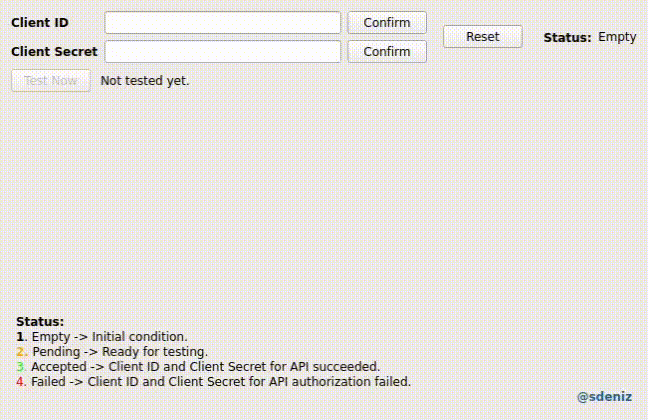

# Qt-GUI-Implementations
Graphic User Interface implementation with PyQt5 for demo version of SpotifyAPI-Random Track Project.

----

Graphic User Interface (**GUI**) implemented with **PyQt5** for demo version of [SpotifyAPI-Random Track Project](https://github.com/rootloginson/SpotifyAPI-ETL-Airflow-AWS).


**A demonstration:** 



---

To run the GUI:\
Command -> ```python3 API-GUI.py```  

*Requirements:*  
PyQt5==5.15.6  
requests==2.26.0  

//  

To obtain **Client ID** and **Client Secret**: \
Log in to -> https://developer.spotify.com/dashboard/ with a spotify account. They can be found in the *Dashboard* tab.
